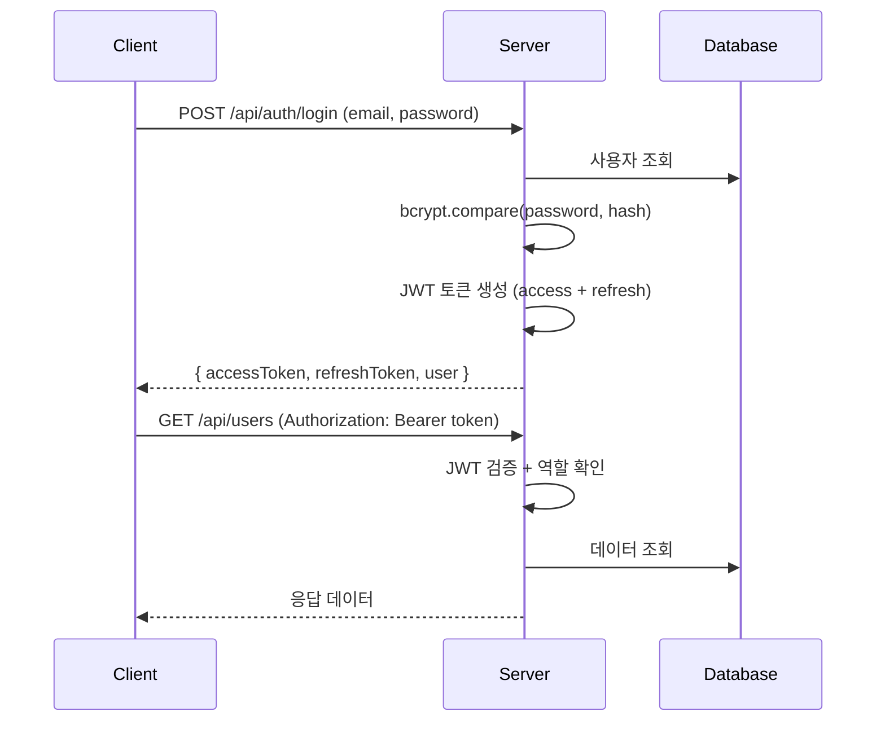

# 로그인 및 회원관리 기능 구현 계획

보안성을 고려한 인증 및 회원관리 시스템 구현 계획입니다.

---

## 보안 아키텍처



### 보안 기능

| 기능 | 구현 방법 |
|------|----------|
| **비밀번호 해싱** | bcrypt (salt rounds: 12) |
| **토큰 인증** | JWT (Access Token: 1h, Refresh Token: 7d) |
| **역할 기반 접근 제어** | admin / user 역할 구분 |
| **입력 유효성 검사** | 이메일 형식, 비밀번호 강도 검증 |
| **에러 메시지 일반화** | 로그인 실패 시 상세 정보 노출 방지 |

---

## Proposed Changes

### 백엔드

#### [NEW] [src/middleware/auth.ts](file:///home/turbo/workspaces/workspace-edu/ocean-admin/backend/src/middleware/auth.ts)
JWT 인증 미들웨어
- 토큰 검증
- 역할 기반 접근 제어 (requireAuth, requireAdmin)

#### [NEW] [src/routes/auth.ts](file:///home/turbo/workspaces/workspace-edu/ocean-admin/backend/src/routes/auth.ts)
인증 API
- `POST /api/auth/register` - 회원가입
- `POST /api/auth/login` - 로그인
- `POST /api/auth/refresh` - 토큰 갱신
- `POST /api/auth/logout` - 로그아웃
- `GET /api/auth/me` - 내 정보 조회

#### [NEW] [src/routes/user.ts](file:///home/turbo/workspaces/workspace-edu/ocean-admin/backend/src/routes/user.ts)
회원관리 API (관리자 전용)
- `GET /api/users` - 회원 목록
- `GET /api/users/:id` - 회원 상세
- `PUT /api/users/:id` - 회원 정보 수정
- `DELETE /api/users/:id` - 회원 삭제

#### [MODIFY] [src/database.ts](file:///home/turbo/workspaces/workspace-edu/ocean-admin/backend/src/database.ts)
users 테이블 스키마 추가

#### [MODIFY] [src/types.ts](file:///home/turbo/workspaces/workspace-edu/ocean-admin/backend/src/types.ts)
User, AuthRequest 타입 정의

---

### 프론트엔드

#### [NEW] [pages/Login.tsx](file:///home/turbo/workspaces/workspace-edu/ocean-admin/front/pages/Login.tsx)
로그인 페이지

#### [NEW] [pages/Register.tsx](file:///home/turbo/workspaces/workspace-edu/ocean-admin/front/pages/Register.tsx)
회원가입 페이지

#### [NEW] [pages/UserList.tsx](file:///home/turbo/workspaces/workspace-edu/ocean-admin/front/pages/UserList.tsx)
회원 목록 페이지 (관리자)

#### [NEW] [contexts/AuthContext.tsx](file:///home/turbo/workspaces/workspace-edu/ocean-admin/front/contexts/AuthContext.tsx)
인증 상태 관리 (Context API)

#### [NEW] [api/auth.ts](file:///home/turbo/workspaces/workspace-edu/ocean-admin/front/api/auth.ts)
인증 API 클라이언트

#### [MODIFY] [App.tsx](file:///home/turbo/workspaces/workspace-edu/ocean-admin/front/App.tsx)
보호된 라우트, 로그인 상태에 따른 UI 분기

#### [MODIFY] [Sidebar.tsx](file:///home/turbo/workspaces/workspace-edu/ocean-admin/front/components/Sidebar.tsx)
로그인 사용자 정보 표시, 로그아웃 기능

---

## 데이터베이스 스키마

```sql
CREATE TABLE users (
    id INTEGER PRIMARY KEY AUTOINCREMENT,
    email TEXT UNIQUE NOT NULL,
    password_hash TEXT NOT NULL,
    name TEXT NOT NULL,
    role TEXT DEFAULT 'user' CHECK(role IN ('admin', 'user')),
    created_at DATETIME DEFAULT CURRENT_TIMESTAMP,
    updated_at DATETIME DEFAULT CURRENT_TIMESTAMP,
    last_login_at DATETIME
);
```

---

## Verification Plan

### API 테스트
```bash
# 회원가입
curl -X POST http://localhost:3001/api/auth/register \
  -H "Content-Type: application/json" \
  -d '{"email":"test@example.com","password":"Test1234!","name":"테스트"}'

# 로그인
curl -X POST http://localhost:3001/api/auth/login \
  -H "Content-Type: application/json" \
  -d '{"email":"test@example.com","password":"Test1234!"}'

# 인증된 요청 (토큰 필요)
curl http://localhost:3001/api/users \
  -H "Authorization: Bearer <ACCESS_TOKEN>"
```

### 보안 검증
- [ ] 잘못된 비밀번호로 로그인 시 동일한 에러 메시지 반환
- [ ] 만료된 토큰으로 접근 시 401 반환
- [ ] 일반 사용자가 관리자 API 접근 시 403 반환
- [ ] 비밀번호 해시가 DB에 안전하게 저장됨

> [!IMPORTANT]
> 의존성 추가 필요: `bcrypt`, `jsonwebtoken`, `@types/bcrypt`, `@types/jsonwebtoken`
