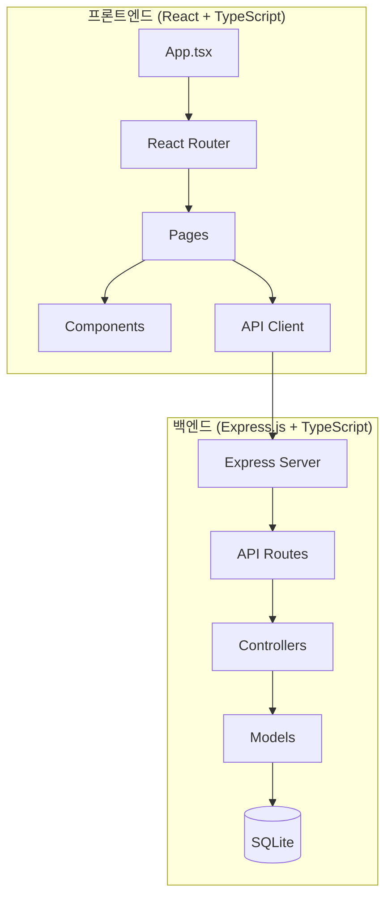

# 게시판 시스템 개발 - 구현 계획

Ocean Admin Dashboard에 게시판(Board) 기능을 추가하기 위한 풀스택 구현 계획입니다.

---

## 현재 프로젝트 분석

### 프론트엔드 (`front/`)
- **프레임워크**: React 19 + TypeScript + Vite
- **스타일링**: TailwindCSS (CDN)
- **UI 라이브러리**: lucide-react (아이콘), recharts (차트)
- **기존 컴포넌트**: Sidebar, StatsCard, RevenueChart, RecentActivity, TransactionsTable

### 백엔드 (`backend/`)
- 현재 빈 디렉토리 - 새로 구축 필요

---

## 권장 아키텍처



### 백엔드 기술 스택
| 기술 | 선택 이유 |
|------|----------|
| **Express.js + TypeScript** | 빠른 개발, 타입 안정성, 프론트엔드와 동일한 언어 |
| **SQLite + better-sqlite3** | 설치 간편, 별도 DB 서버 불필요, 개발/테스트 용이 |
| **CORS** | 프론트엔드-백엔드 분리 환경에서 필수 |

### 프론트엔드 추가 기술
| 기술 | 선택 이유 |
|------|----------|
| **React Router** | SPA 라우팅, 기존 구조와 호환 |
| **Fetch API** | 별도 라이브러리 없이 HTTP 통신 |

---

## Proposed Changes

### 백엔드 구조

#### [NEW] [package.json](file:///home/turbo/workspaces/workspace-edu/ocean-admin/backend/package.json)
Express.js + TypeScript 프로젝트 설정

#### [NEW] [tsconfig.json](file:///home/turbo/workspaces/workspace-edu/ocean-admin/backend/tsconfig.json)
TypeScript 컴파일 설정

#### [NEW] [src/index.ts](file:///home/turbo/workspaces/workspace-edu/ocean-admin/backend/src/index.ts)
메인 서버 엔트리포인트

#### [NEW] [src/database.ts](file:///home/turbo/workspaces/workspace-edu/ocean-admin/backend/src/database.ts)
SQLite 데이터베이스 연결 및 스키마 초기화

#### [NEW] [src/routes/board.ts](file:///home/turbo/workspaces/workspace-edu/ocean-admin/backend/src/routes/board.ts)
게시판 CRUD API 라우트
- `GET /api/boards` - 목록 조회 (페이지네이션)
- `GET /api/boards/:id` - 상세 조회
- `POST /api/boards` - 작성
- `PUT /api/boards/:id` - 수정
- `DELETE /api/boards/:id` - 삭제

#### [NEW] [src/types.ts](file:///home/turbo/workspaces/workspace-edu/ocean-admin/backend/src/types.ts)
타입 정의

---

### 프론트엔드 구조

#### [MODIFY] [package.json](file:///home/turbo/workspaces/workspace-edu/ocean-admin/front/package.json)
react-router-dom 의존성 추가

#### [MODIFY] [App.tsx](file:///home/turbo/workspaces/workspace-edu/ocean-admin/front/App.tsx)
React Router 적용, 페이지 라우팅 추가

#### [MODIFY] [Sidebar.tsx](file:///home/turbo/workspaces/workspace-edu/ocean-admin/front/components/Sidebar.tsx)
게시판 메뉴 추가 및 라우터 Link 사용

#### [NEW] [pages/Dashboard.tsx](file:///home/turbo/workspaces/workspace-edu/ocean-admin/front/pages/Dashboard.tsx)
기존 대시보드 내용을 페이지 컴포넌트로 분리

#### [NEW] [pages/BoardList.tsx](file:///home/turbo/workspaces/workspace-edu/ocean-admin/front/pages/BoardList.tsx)
게시판 목록 페이지
- 테이블 형태로 게시글 목록 표시
- 페이지네이션
- 검색 기능
- 글쓰기 버튼

#### [NEW] [pages/BoardDetail.tsx](file:///home/turbo/workspaces/workspace-edu/ocean-admin/front/pages/BoardDetail.tsx)
게시글 상세 페이지
- 제목, 작성자, 날짜, 내용 표시
- 수정/삭제 버튼
- 목록으로 버튼

#### [NEW] [pages/BoardWrite.tsx](file:///home/turbo/workspaces/workspace-edu/ocean-admin/front/pages/BoardWrite.tsx)
게시글 작성/수정 페이지
- 제목, 내용 입력 폼
- 저장/취소 버튼

#### [MODIFY] [types.ts](file:///home/turbo/workspaces/workspace-edu/ocean-admin/front/types.ts)
Board 타입 정의 추가

#### [NEW] [api/board.ts](file:///home/turbo/workspaces/workspace-edu/ocean-admin/front/api/board.ts)
게시판 API 클라이언트

---

## 데이터베이스 스키마

```sql
CREATE TABLE boards (
    id INTEGER PRIMARY KEY AUTOINCREMENT,
    title TEXT NOT NULL,
    content TEXT NOT NULL,
    author TEXT NOT NULL,
    created_at DATETIME DEFAULT CURRENT_TIMESTAMP,
    updated_at DATETIME DEFAULT CURRENT_TIMESTAMP,
    view_count INTEGER DEFAULT 0
);
```

---

## Verification Plan

### 자동화 테스트

1. **백엔드 서버 시작 테스트**
   ```bash
   cd /home/turbo/workspaces/workspace-edu/ocean-admin/backend
   npm install
   npm run dev
   # 서버가 http://localhost:3001에서 실행되는지 확인
   ```

2. **API 엔드포인트 테스트 (curl)**
   ```bash
   # 게시글 작성
   curl -X POST http://localhost:3001/api/boards \
     -H "Content-Type: application/json" \
     -d '{"title":"테스트 제목","content":"테스트 내용","author":"관리자"}'
   
   # 목록 조회
   curl http://localhost:3001/api/boards
   
   # 상세 조회
   curl http://localhost:3001/api/boards/1
   
   # 수정
   curl -X PUT http://localhost:3001/api/boards/1 \
     -H "Content-Type: application/json" \
     -d '{"title":"수정된 제목","content":"수정된 내용"}'
   
   # 삭제
   curl -X DELETE http://localhost:3001/api/boards/1
   ```

3. **프론트엔드 빌드 테스트**
   ```bash
   cd /home/turbo/workspaces/workspace-edu/ocean-admin/front
   npm install
   npm run dev
   # 빌드 에러 없이 실행되는지 확인
   ```

### 수동 테스트 (브라우저)

1. **프론트엔드 접속**: `http://localhost:5173`
2. **사이드바에서 "게시판" 메뉴 클릭**
3. **게시판 목록 페이지 확인**
   - 테이블에 게시글 목록이 보이는지
   - 페이지네이션이 동작하는지
4. **글쓰기 테스트**
   - "글쓰기" 버튼 클릭
   - 제목, 내용 입력 후 저장
   - 목록에 새 글이 추가되는지 확인
5. **상세보기/수정/삭제 테스트**
   - 목록에서 글 클릭하여 상세보기
   - 수정 버튼으로 내용 수정
   - 삭제 버튼으로 글 삭제

---

> [!IMPORTANT]
> 백엔드와 프론트엔드를 **동시에 실행**해야 합니다.
> - 백엔드: `npm run dev` (포트 3001)
> - 프론트엔드: `npm run dev` (포트 5173)
